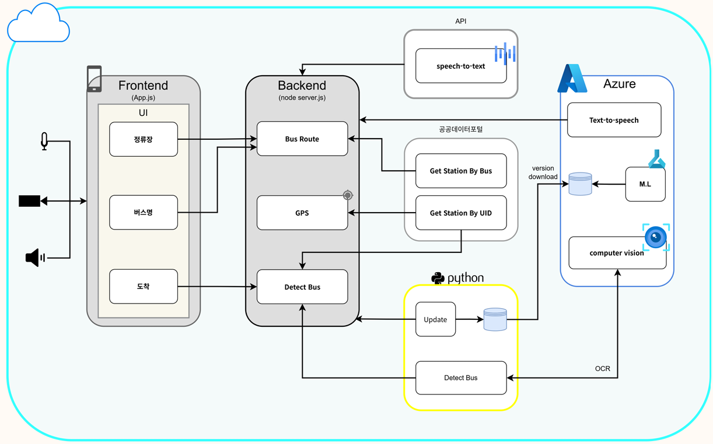

# 🚌 LightBus

> 시각 및 인지 약자를 위한 지능형 음성 버스 탑승 안내 솔루션

**"들리는 시야, 막힘없는 이동"**

LightBus는 시각장애인 및 인지 약자가 보다 쉽고 안전하게 버스를 이용할 수 있도록 지원하는 AI 기반 스마트 모빌리티 서비스입니다.

사용자가 음성으로 버스 번호 또는 목적지를 입력하면 GPS, 공공데이터 API, 컴퓨터 비전(OCR) 기술을 활용하여 원하는 버스의 도착 여부를 실시간으로 음성 안내합니다. 

---

## 📌 프로젝트 소개

서울시를 비롯한 국내 대중교통 인프라는 지속적으로 발전하고 있지만, 시각장애인에게는 여전히

> "지금 도착한 버스가 내가 타야 하는 버스인가?"

라는 문제가 존재합니다.

LightBus는 별도의 비콘이나 외부 설치 장비 없이 사용자의 스마트폰만을 활용하여 버스 도착 여부를 스스로 확인할 수 있도록 지원하는 인프라 독립형 솔루션입니다.

---

## 👨‍💻 Team InsightNode

| 이름 | 담당 역할 |
|--------|--------|
| 최진웅 | [팀장] 버스 번호판 인식 로컬 서버 구축 |
| 김효정 | STT/TTS 음성 인터랙션 구현 |
| 박휘소 | 공공데이터 API 연동 및 백엔드 서버 구축 |
| 임치영 | 접근성 중심 UI/UX 및 프론트엔드 개발 |
| 채서영 | YOLOv11 · YOLOv12 모델 학습 및 데이터셋 고도화 |

---

## 🏗️ 시스템 아키텍처

<p align="center">
  
</p>

---

## 🚀 주요 기능

### 🎤 음성 입력 (STT)

- 버스 번호 음성 입력
- 목적지 음성 입력
- 실시간 음성 명령 인식

### 📍 GPS 기반 위치 탐색

- 현재 위치 확인
- 인근 버스 정류장 탐색
- 서울시 버스 정류장 정보 연동

### 🚌 실시간 버스 도착 정보

- 버스 도착 예정 정보 조회
- 사용자가 요청한 버스 필터링

### 📷 AI 버스 탐지

- YOLO 기반 버스 객체 탐지
- 실시간 카메라 영상 분석
- 버스 접근 여부 판단

### 🔍 번호판 OCR 인식

- 버스 번호 영역 추출
- Azure Computer Vision OCR 적용
- 버스 번호 텍스트 인식

### 🔊 음성 안내 (TTS)

- 버스 도착 안내
- 번호 일치 여부 안내
- 실시간 음성 피드백 제공

---

## ⚙️ 기술 스택

### Frontend

- React
- JavaScript
- HTML5
- CSS3
- Web Speech API
- Geolocation API

### Backend

- Node.js
- Express
- FastAPI

### AI

- Python
- YOLOv11
- YOLOv12
- OpenCV

### Azure

- Azure Machine Learning
- Azure Computer Vision OCR
- Azure Speech Service (STT / TTS)

### Data

- 서울시 열린데이터광장 API
- 버스 정류장 위치 정보 API
- 실시간 버스 도착 정보 API


---

## 🤖 AI 모델

### YOLOv11 Bus Detection

- Object Detection 기반 버스 탐지 모델
- Kaggle 교통 데이터셋 활용
- Bus 단일 클래스로 재학습
- 실시간 검출 환경 최적화

학습 결과

- Precision ≈ 0.9
- Recall ≈ 0.8
- mAP50 ≈ 0.8
- mAP50-95 ≈ 0.65


---

## 📂 프로젝트 구조

```text
LightBus
│
├── client
│   ├── public
│   └── src
│
├── server
│   ├── main.py
│   ├── detect_bus.py
│   └── models
│
├── docs
│   └── System_Architecture.png
│
├── server.cjs
├── package.json
└── README.md
```

---

## 🖥️ 실행 방법

### 1️⃣ FastAPI 서버 실행

```bash
cd server
python -m uvicorn main:app --reload
```

기본 주소

```text
http://localhost:8000
```

---

### 2️⃣ Node 서버 실행

```bash
node server.cjs
```

---

### 3️⃣ 프론트엔드 실행

```bash
npm install
npm run dev
```

---

## 🔄 서비스 동작 과정

1. 사용자가 음성으로 버스 번호 입력
2. GPS를 통해 현재 위치 확인
3. 인근 버스 정류장 조회
4. 공공데이터 API로 버스 도착 정보 확인
5. 카메라 영상에서 버스 탐지
6. OCR로 번호판 인식
7. 입력 버스 번호와 비교
8. 일치 시 TTS 음성 안내

---

## 🎯 기대 효과

- 시각장애인의 이동권 향상
- 대중교통 접근성 개선
- 스마트폰 기반 자립형 서비스 제공
- 추가 인프라 구축 비용 최소화

---

## 🔮 향후 발전 방향

- 전국 버스 노선 데이터 확장
- 경기도 및 광역시 데이터 통합
- 목적 버스 기반 최적 정류장 추천
- 스마트 글래스 연동
- 장애물 및 위험 요소 실시간 감지
- 스마트 시티 교통 시스템 연계

---

## 📜 License

Microsoft AI School 4기  
Team InsightNode Project

---

## 🎥 Demo

발표 자료 및 시연 영상을 통해 LightBus의 전체 동작 과정을 확인할 수 있습니다.

**LightBus**
**"들리는 시야, 막힘없는 이동"**